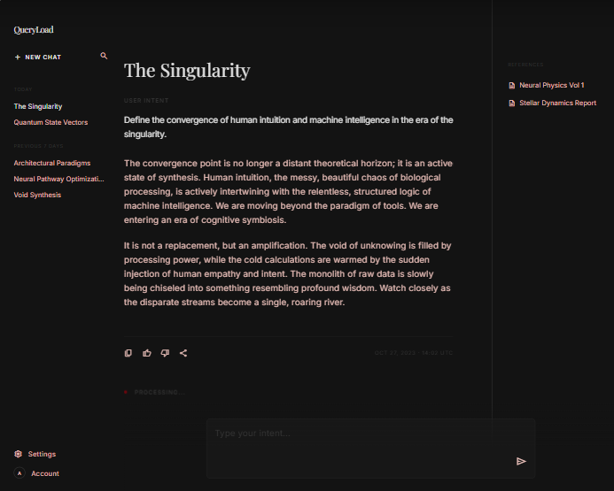

<p align="center">
  
</p>

<h1 align="center">QueryLoad</h1>

<p align="center">
  A desktop app that answers questions about your own documents —<br>
  entirely on your machine, with every answer traceable to the page it came from.
</p>

<p align="center">
  
  
  
  
  
  
</p>

> **This project is in active development.**
> It runs, indexes documents and returns grounded, cited answers from a local
> model — but it is not finished and not released. There is no installer yet,
> and behaviour is still changing. [Status](#status) gives a plain account of
> what is and is not done.

---

## What it is

Point QueryLoad at a folder of documents — contracts, case files, patient
records, correspondence — and ask questions in plain English. It reads PDFs,
Word files, emails (including Outlook `.pst` archives), spreadsheets and scanned
images, and answers using only what those documents actually say.

Two things separate it from a general chat assistant:

**Nothing leaves the machine.** The language model runs locally. Confidential
files are never uploaded to anyone's servers, and the app works with the network
switched off. This is enforced, not promised: a build step fails the moment any
shipped code gains an outbound network call, with one narrow exception for the
user-initiated model download.

**Every claim is traceable.** Answers carry inline markers that resolve to a
specific document and page, and clicking one opens the source at that page. When
the documents do not contain the answer, the app says so rather than filling the
gap.

It is built for confidentiality-sensitive work: walled workspaces so staff only
see the matters they are assigned, role-based access, an audit trail of who
asked what and which sources were used, and independent retention rules for
documents, conversations and the audit log.

## Interface

<p align="center">
  
</p>

Three regions: chat history and workspace switcher on the left, the answer
column in the centre, and a references rail on the right listing every source
behind the current answer. Citation markers in the text are clickable and open
the document at the cited page.

## Feature surface

**Document intake**
- 19 file types: PDF, DOCX, EML, MSG, PST (Outlook archives), TXT, MD, CSV, LOG,
  and images (PNG, JPG, TIFF, BMP, GIF, WEBP)
- Folder watching — new and changed files are re-indexed automatically
- Page-level and character-level offsets retained per chunk, so a citation
  points at a location rather than a whole file
- Failed extractions are quarantined with the reason, not silently skipped
- Sample-based time estimate before indexing a large archive

**Answering**
- Retrieval scoped to the active workspace, enforced inside the query
- Relevance floor — weak matches are dropped rather than padded into the prompt
- Pinned files always enter the context, without crowding out retrieval
- Grounded refusal when the corpus does not cover the question
- Streaming answers with a stop control
- Task library (summarise, compare, extract) layered over the same retrieval
- Reasoning-model scratchpad stripped before it reaches the answer, transcript
  or audit log

**Local models**
- Curated catalogue of **23 models, 0.8 GB to 44 GB**, every one under a licence
  permitting commercial use (Apache 2.0, MIT, Llama Community, Gemma)
- Hardware check first — RAM, CPU, GPU and free disk — marking which models fit
- Resumable, size-verified downloads; cancel, resume and discard
- One model active at a time, swappable without leaving the conversation
- Parallel request slots with per-user round-robin fairness and queue position

**Governance**
- Workspaces as hard access boundaries between matters or clients
- Three roles: admin, member, auditor
- Audit log of every query, its sources, and the user
- Retention policies applied independently to documents, chats and the audit log
- Organization mode: one machine serves the office over the LAN, discovered via
  mDNS and joined with a code
- Diagnostic bundle for support — logs, config and hardware, never document
  content

**Security**
- Loopback HTTPS with a self-signed certificate pinned by SHA-256 fingerprint
- Metadata database encrypted (SQLCipher); key sealed to the machine by Windows
  DPAPI
- Text and vectors stored separately — the vector index holds no document text
- Argon2id password hashing; sessions stored as hashes and revocable
- Electron hardening: context isolation, sandbox, no node integration, strict
  CSP, navigation and permission requests denied by default
- Prompt-injection resistance: retrieved text is fenced inside delimiters
  derived from a hash of the query and the retrieved passages, so no single
  document can predict the fence and escape its quoted block

## Architecture

```
                    ┌──────────────────────────────────────────┐
                    │  Electron shell (desktop)                │
                    │  window · preload bridge · OS dialogs    │
                    │  supervises the engine process           │
                    └───────────────┬──────────────────────────┘
                                    │ spawns
                                    ▼
   ┌────────────┐   loopback   ┌──────────────────────────────────────┐
   │  Renderer  │◄────HTTPS────►│  Engine (Node, headless-capable)     │
   │  React 19  │  cert pinned  │                                      │
   │ pure client│               │  ingestion → extract → chunk → embed │
   └────────────┘               │  retrieval (workspace-scoped)        │
                                │  RAG prompt assembly + citations     │
                                │  auth · audit · retention            │
                                └──────┬───────────────┬───────────────┘
                                       │               │
                        ┌──────────────▼──┐   ┌────────▼─────────────┐
                        │ SQLCipher DB    │   │ LanceDB vector index │
                        │ metadata, chunk │   │ embeddings only —    │
                        │ text, audit     │   │ no document text     │
                        └─────────────────┘   └──────────────────────┘
                                       │
                            ┌──────────▼──────────┐
                            │ llama.cpp sidecars  │
                            │ chat + embeddings   │
                            │ loopback, hidden    │
                            └─────────────────────┘
```

The engine is a standalone process, not a library inside the UI. It can run
headless, which is what makes organization mode possible: the same binary that
backs the desktop app serves a whole office over the LAN. The renderer holds no
business logic — it is a pure client of the engine's API, so the security
boundary is the API surface rather than a convention.

## Tech stack

| Layer | Choice |
|---|---|
| Desktop shell | Electron 43 (context isolation, sandbox, strict CSP) |
| Renderer | React 19 · Vite 6 · TypeScript 5.7 (strict) |
| Engine | Node 22+ · TypeScript · loopback HTTPS |
| Inference | llama.cpp server sidecars, GGUF models, continuous batching |
| Vector index | LanceDB |
| Metadata store | SQLite via SQLCipher (`better-sqlite3-multiple-ciphers`) |
| Key protection | Windows DPAPI |
| Passwords | Argon2id (`@node-rs/argon2`) |
| Extraction | MuPDF · Mammoth (DOCX) · mailparser · pst-extractor · msgreader |
| File watching | chokidar |
| Logging | pino (structured, local only) |
| Service discovery | Bonjour / mDNS (LAN mode) |
| Packaging | electron-builder (NSIS + MSI) |
| Tests | 8 acceptance suites · vitest · ESLint · Prettier |

## Project structure

```
packages/
  shared/          API contract types, constants, design tokens (no runtime deps)
  engine/
    ingestion/     watcher, pipeline, extraction handlers per format
    index/         vector store
    embedding/     embedder interface + BGE-M3
    inference/     runtime supervision, backends, scheduler
    rag/           retrieval, prompt assembly, query orchestration, tasks
    db/            schema + migrations, repositories
    server/        HTTPS server, routes, auth middleware
    auth/ audit/ retention/ security/ export/ diagnostics/
  ui/              React renderer — views, API client, design tokens
  desktop/         Electron main, preload, engine supervisor, IPC
scripts/           build tooling, 8 acceptance suites, network audit
corpus/            synthetic demo documents (fictional, ships with the app)
docs/              threat model, deployment, sizing
DECISIONS.md       design decisions the source cites by number
```

## Running it

Requires Windows and Node 22+ (see `.nvmrc`).

```bash
npm ci
npm run fetch:runtime      # downloads + SHA-256 verifies the llama.cpp runtime
npm run dev                # builds, starts the Vite server, launches the app
```

`npm run dev` runs the renderer with hot reload and supervises the engine. For a
production-style run, `npm run build` then `npm run dist` produces the
installers.

Then choose a model in the app. The hardware check runs first and marks which of
the 23 models will actually run well on the machine.

**Verification**

```bash
npm run verify:all         # build · typecheck · lint · network audit
                           # · 8 acceptance suites · UI layout test
```

| Command | What it proves |
|---|---|
| `npm run verify:network` | No shipped code can reach the network |
| `npm run verify:runtime` | An installer cannot be built without the inference runtime |
| `npm run dist` | Produces the NSIS + MSI installers |

## Engineering notes

Files worth a look if you are reviewing the code:

- **`scripts/verify-no-runtime-network.mjs`** — the privacy claim as a build
  gate rather than a README assertion.
- **`packages/engine/src/rag/prompt.ts`** — grounded prompt assembly and the
  deterministic injection fence.
- **`packages/engine/src/rag/thinking.ts`** — streaming filter that strips a
  reasoning model's scratchpad before it can reach the answer, transcript or
  audit log, handling markers split across token boundaries.
- **`packages/engine/src/inference/scheduler.ts`** — parallel slots, per-user
  round-robin fairness, and separate budgets for time-to-first-token and
  mid-stream stalls.
- **`packages/engine/src/db/schema.ts`** — versioned migrations with the schema
  version derived from the migration list rather than hand-maintained.
- **`scripts/fetch-llama-runtime.mjs`** — build-time runtime fetch, pinned by
  tag and SHA-256 and pruned to the files actually loaded, which is what keeps
  the shipped app free of any runtime network call.

**Scale:** ~11,700 lines across 108 TypeScript source files; 121 assertions
across 8 acceptance suites, run by a single command.

## Status

**In development — built and working, not shipped.** The app runs, indexes
documents and returns grounded, cited answers from a local model. What is *not*
done:

- No signed installer has been produced. Packaging is configured and its parts
  proven individually, but no release build exists yet.
- Model checksums are not yet pinned in the catalogue (`sha256: null`), so
  downloads are size-verified but not hash-verified.
- Answer quality depends heavily on the chosen model. Small models (1–3 B) will
  sometimes misstate what a document says — a property of the models, and much
  of why the citation trail matters.
- Windows only. macOS and Linux are not built.

## About

QueryLoad is a public extract of a private working repository: full source,
build tooling, acceptance suites and the design decisions the code cites.
Commercial planning documents are not included.

Built by [Emem Ndon](https://github.com/ememndon).

## Licence

Proprietary — see [LICENSE](LICENSE). Published for review and evaluation; no
licence to use, copy, modify or distribute is granted.
